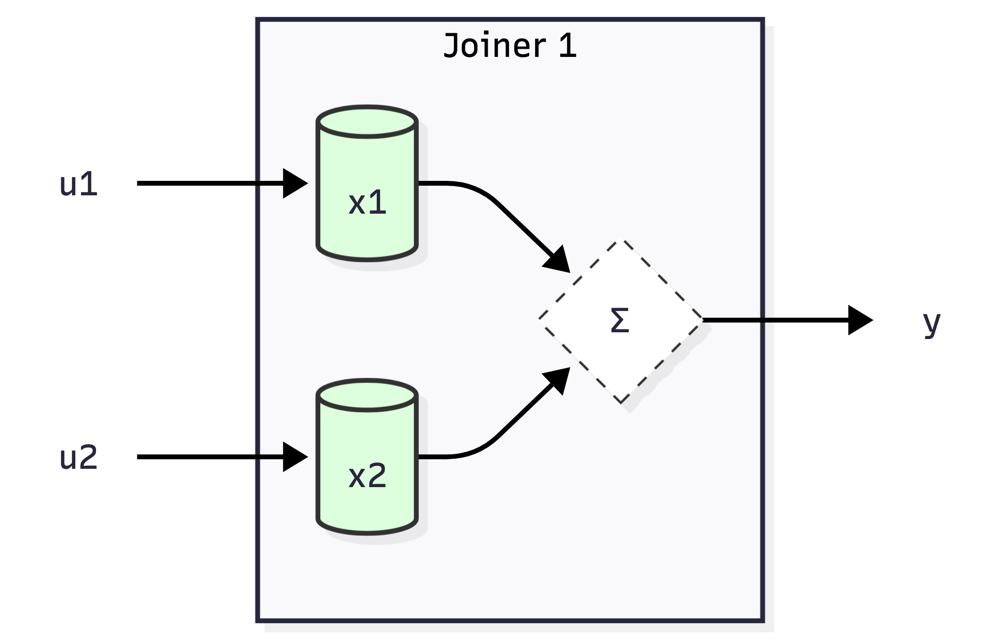
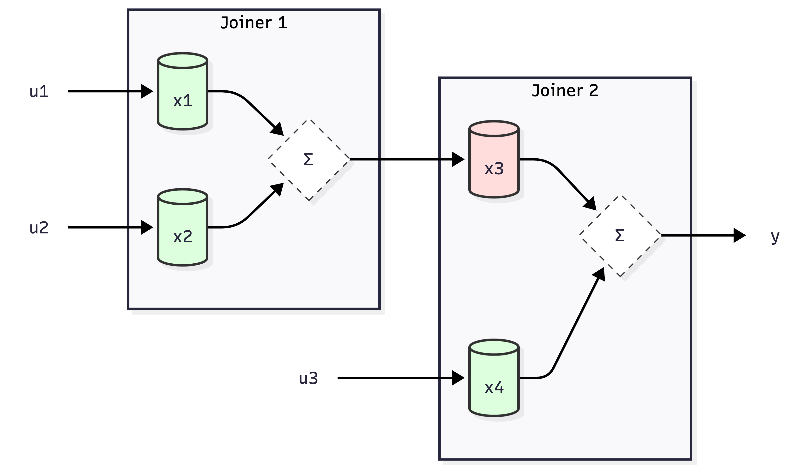
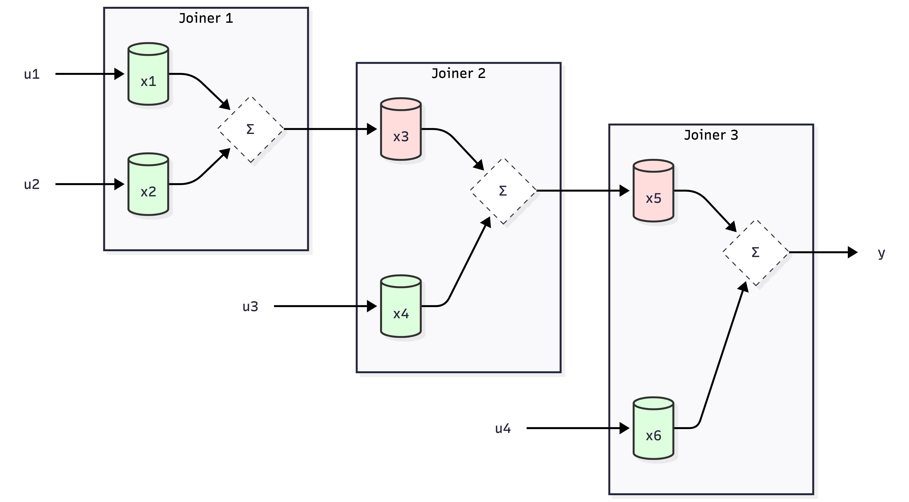
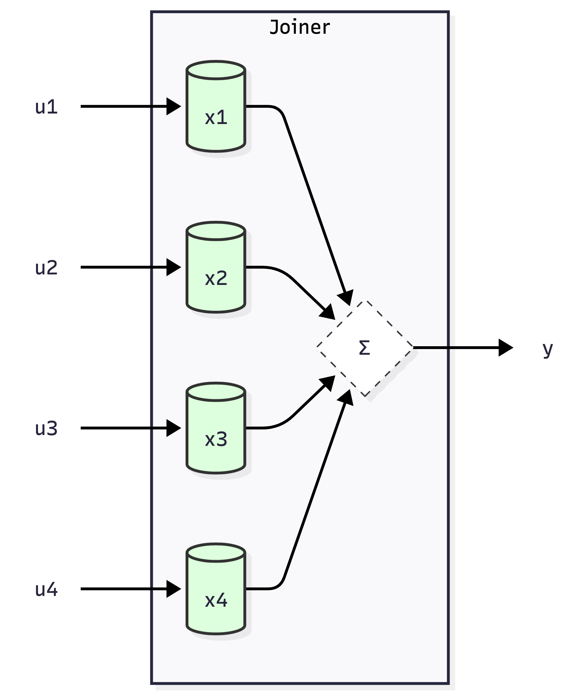
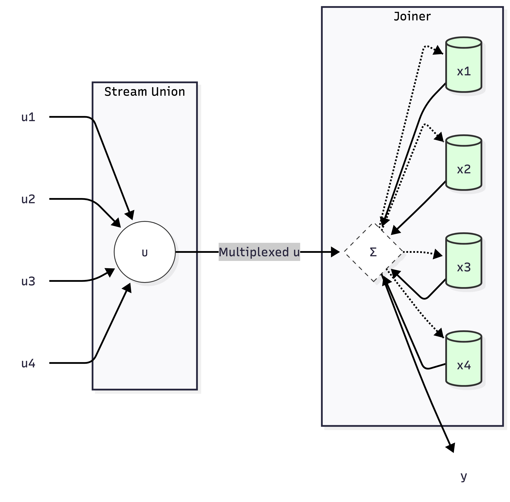
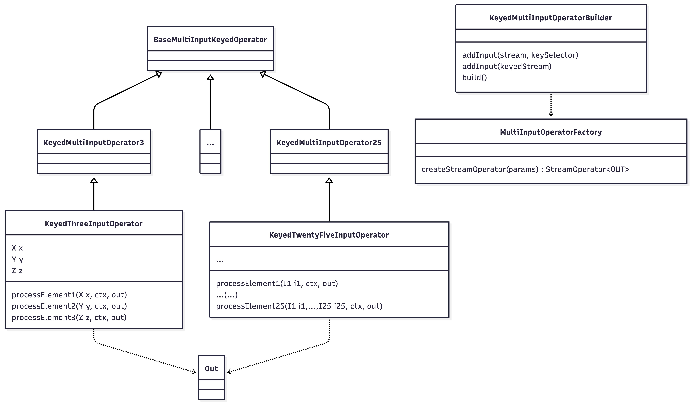
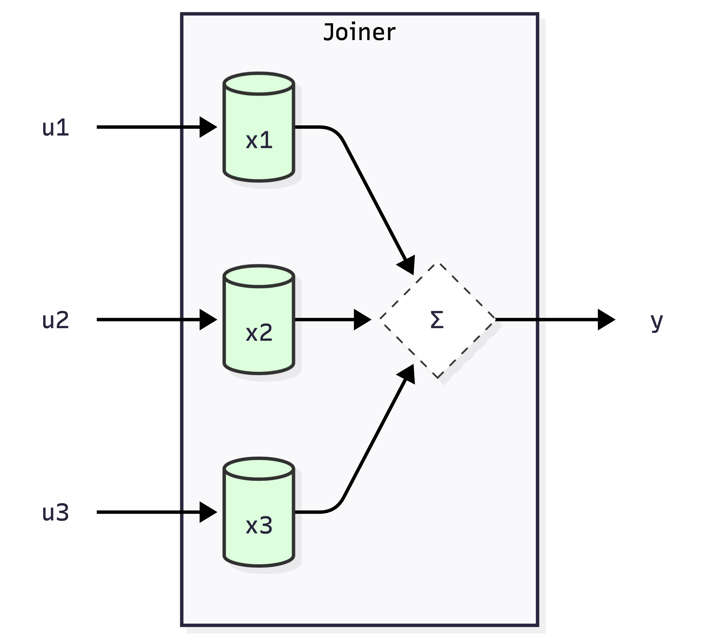
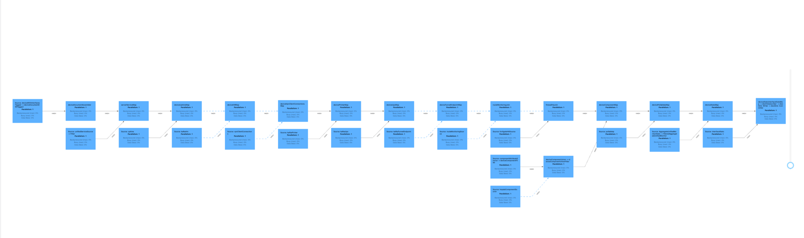

# Multi-Way Joins

*Cybernetically Enhanced*

<small></br>Salva Alcántara</small>

 <!-- .element width="12.5%" -->


## Concept 

```sql
INSERT INTO Y
SELECT *
FROM U1 u1
  JOIN U2 u2 ON u1.id = u2.id
  JOIN U3 u3 ON u1.id = u3.id
  ...
  JOIN UN un ON u1.id = un.id

SET 'table.optimizer.multi-join.enabled' = 'true';
```
<!-- .element style="font-size:0.5em" -->

> See more [here](https://nightlies.apache.org/flink/flink-docs-stable/docs/dev/table/tuning/#multiple-regular-joins).
<!-- .element style="font-size:0.5em" -->

> ⚠️ Here, though, we address the [DataSream API](https://nightlies.apache.org/flink/flink-docs-stable/docs/dev/datastream/overview/) *counterpart* ([FLINK-39131](https://issues.apache.org/jira/projects/FLINK/issues/FLINK-39131)). 
<!-- .element style="font-size:0.5em" -->


## Multi-Way Joins
#### *Non-Minimal* Realization

<!-- .slide: data-background-color="var(--r-auvik-red-color)" -->


## Multi-Way Joins (N=2)
<!-- .slide:data-auto-animate -->

 <!-- .element width="40%" -->

$$
\begin{array}{rcrcr}
\begin{bmatrix} x_1 \\\\ x_2 \end{bmatrix}_{k+1} & = & \begin{bmatrix} 0 & 0 \\\\ 0 & 0 \end{bmatrix} \begin{bmatrix} x_1 \\\\ x_2 \end{bmatrix}_k & + & \begin{bmatrix} 1 & 0 \\\\ 0 & 1 \end{bmatrix} \begin{bmatrix} u_1 \\\\ u_2 \end{bmatrix}_k \\\\
y_k & = & \begin{bmatrix} 1 & 1 \end{bmatrix} \begin{bmatrix} x_1 \\\\ x_2 \end{bmatrix}_k & & 
\end{array}
$$
<!-- .element style="font-size:0.5em" -->

$$\implies y_k = u_1[k-1] + u_2[k-1]$$
<!-- .element style="font-size:0.5em" -->


## Multi-Way Joins (N=3)
<!-- .slide:data-auto-animate -->

 <!-- .element width="30%" -->

$$
\begin{array}{rcrcr}
\begin{bmatrix} x_1 \\\\ x_2 \\\\ x_3 \\\\ x_4 \end{bmatrix}_{k+1} & = & \begin{bmatrix} 0 & 0 & 0 & 0 \\\\ 0 & 0 & 0 & 0 \\\\ 1 & 1 & 0 & 0 \\\\ 0 & 0 & 0 & 0 \end{bmatrix} \begin{bmatrix} x_1 \\\\ x_2 \\\\ x_3 \\\\ x_4 \end{bmatrix}_k & + & \begin{bmatrix} 1 & 0 & 0 \\\\ 0 & 1 & 0 \\\\ 0 & 0 & 0 \\\\ 0 & 0 & 1 \end{bmatrix} \begin{bmatrix} u_1 \\\\ u_2 \\\\ u_3 \end{bmatrix}_k \\\\
y_k & = & \begin{bmatrix} 0 & 0 & 1 & 1 \end{bmatrix} \begin{bmatrix} x_1 \\\\ x_2 \\\\ x_3 \\\\ x_4 \end{bmatrix}_k & & 
\end{array}
$$
<!-- .element style="font-size:0.33em" -->

$$\implies y_k = u_1[k-2] + u_2[k-2] + u_3[k-1]$$
<!-- .element style="font-size:0.5em" -->


## Multi-Way Joins (N=4)
<!-- .slide:data-auto-animate -->

 <!-- .element width="30%" -->

$$
\begin{array}{rcrcr}
\begin{bmatrix} x_1 \\\\ x_2 \\\\ x_3 \\\\ x_4 \\\\ x_5 \\\\ x_6 \end{bmatrix}_{k+1} & = & \begin{bmatrix} 0 & 0 & 0 & 0 & 0 & 0 \\\\ 0 & 0 & 0 & 0 & 0 & 0 \\\\ 1 & 1 & 0 & 0 & 0 & 0 \\\\ 0 & 0 & 0 & 0 & 0 & 0 \\\\ 0 & 0 & 1 & 1 & 0 & 0 \\\\ 0 & 0 & 0 & 0 & 0 & 0 \end{bmatrix} \begin{bmatrix} x_1 \\\\ x_2 \\\\ x_3 \\\\ x_4 \\\\ x_5 \\\\ x_6 \end{bmatrix}_k & + & \begin{bmatrix} 1 & 0 & 0 & 0 \\\\ 0 & 1 & 0 & 0 \\\\ 0 & 0 & 0 & 0 \\\\ 0 & 0 & 1 & 0 \\\\ 0 & 0 & 0 & 0 \\\\ 0 & 0 & 0 & 1 \end{bmatrix} \begin{bmatrix} u_1 \\\\ u_2 \\\\ u_3 \\\\ u_4 \end{bmatrix}_k \\\\
y_k & = & \begin{bmatrix} 0 & 0 & 0 & 0 & 1 & 1 \end{bmatrix} \begin{bmatrix} x_1 \\\\ x_2 \\\\ x_3 \\\\ x_4 \\\\ x_5 \\\\ x_6 \end{bmatrix}_k & & 
\end{array}
$$
<!-- .element style="font-size:0.225em" -->

$$\implies y_k = u_1[k-3] + u_2[k-3] + u_3[k-2] + u_4[k-1]$$
<!-- .element style="font-size:0.5em" -->


## Multi-Way Joins

$$
\begin{array}{rcl}
\mathscr{M} & = & N \times S + \sum_{i=2}^{N-1} i \times S \\\\
  & = & N \times S + \left[ \frac{(N-1)N}{2} - 1 \right] \times S \\\\
  & = & \frac{N^2 + N - 2}{2} \times S
\end{array}
$$
<!-- .element style="font-size:0.5em" -->

$$ \implies \mathscr{R} = \frac{N^2 + N - 2}{2N} \approx \frac{N}{2} $$
<!-- .element style="font-size:0.5em" -->

| Inputs ($N$) | Redundancy ($\mathscr{R}$) | Waste (%) |
| :--- | :--- | :--- |
| 2 | **1x** | 0% |
| 3 | **1.67x** | 67% |
| 4 | **2.25x** | 125% |
| **10** | **5.40x** | **440%** |
<!-- .element style="font-size:0.5em" -->


## Multi-Way Joins
#### *Minimal* Realization

<!-- .slide: data-background-color="var(--r-auvik-blue-color)" -->


## Multi-Way Joins

 <!-- .element width="33%" -->

$$
\begin{array}{rcrcr}
\mathbf{x}_{k+1} & = & \mathbf{0} \mathbf{x}_k & + & \mathbf{I} \mathbf{u}_k \\\\\\\\
y_k & = & \mathbf{1}^T \mathbf{x}_k & & 
\end{array} 
\implies y_k = \sum_\{i=1\}^\{N\} u_i[k-1]
$$
<!-- .element style="font-size:0.425em" -->


## The—*DIY*—Pattern

 <!-- .element width="40%" -->

> See [here](https://lists.apache.org/thread/90f9dr5d414wsp2d8yt8g35og5ddrmww) and [here](https://www.youtube.com/watch?v=tiGxEGPyqCg).
<!-- .element style="font-size:0.5em" -->


## The—*ergo*—Solution
<!-- .slide:data-auto-animate -->

 <!-- .element width="33%" -->


## The—*ergo*—Solution
<!-- .slide:data-auto-animate -->

 <!-- .element width="66%" -->

> See more in [FLINK-39131](https://issues.apache.org/jira/projects/FLINK/issues/FLINK-39131).
<!-- .element style="font-size:0.5em" -->


## The—*ergo*—Solution
<!-- .slide:data-auto-animate -->

```java
KeyedMultiInputOperatorBuilder<String, Out> builder =
    new KeyedMultiInputOperatorBuilder<>(
        env,
        KeyedThreeInputOperator.class,
        TypeInformation.of(Out.class),
        Types.STRING
    );

builder
    .addInput(xs, X::getKey)
    .addInput(ys, Y::getKey)
    .addInput(zs, Z::getKey);

DataStream<Out> joined = builder.build("xyz-join");
```
<!-- .element style="font-size:0.225em" -->

```java
public class KeyedThreeInputOperator extends KeyedMultiInputOperator3<X, Y, Z, Out> {
  @Override
  protected void processElement1(X x, Context ctx, Collector<Out> out) throws Exception {
    lastX.update(x.getX());
    join(ctx, out);
  }

  @Override
  protected void processElement2(Y y, Context ctx, Collector<Out> out) throws Exception {
    lastY.update(y.getY());
    join(ctx, out);
  }

  @Override
  protected void processElement3(Z z, Context ctx, Collector<Out> out) throws Exception {
    lastZ.update(z.getZ());
    join(ctx, out);
  }
}
```
<!-- .element style="font-size:0.225em" -->

> See the actual code [here](https://github.com/ds-co-dev/flink-multi-input-operator/blob/main/src/test/java/dev/ds_co/flink/streaming/api/operators/MultiInputIntegrationTest.java) and [here](https://github.com/ds-co-dev/flink-multi-input-operator/blob/main/src/test/java/dev/ds_co/flink/streaming/api/operators/testing/KeyedThreeInputOperator.java).
<!-- .element style="font-size:0.5em" -->


## Application
#### *Rewriting Existing Jobs*

<!-- .slide: data-background-color="var(--r-auvik-purple-color)" -->


## Before
<!-- .slide:data-auto-animate -->

 <!-- .element width="25%" -->

```java
DataStream<Out> joined =
    xs.keyBy(X::getKey)
        .connect(ys.keyBy(Y::getKey))
        .process(new Joiner1())
        .keyBy(XY::getKey)
        .connect(zs.keyBy(Z::getKey))
        .process(new Joiner2());
```
<!-- .element style="font-size:0.2em" -->

```java
class Joiner1 extends KeyedCoProcessFunction<String, X, Y, XY> {
  public void processElement1(X x, Context ctx, Collector<XY> out) throws Exception {
    lastX.update(x.getX());
    join(ctx, out);
  }

  public void processElement2(Y y, Context ctx, Collector<XY> out) throws Exception {
    lastY.update(y.getY());
    join(ctx, out);
  }
}

class Joiner2 extends KeyedCoProcessFunction<String, XY, Z, Out> {
  public void processElement1(XY xy, Context ctx, Collector<Out> out) throws Exception {
    lastXY.update(xy);
    join(ctx, out);
  }

  public void processElement2(Z z, Context ctx, Collector<Out> out) throws Exception {
    lastZ.update(z.getZ());
    join(ctx, out);
  }
}
```
<!-- .element style="font-size:0.2em" -->


## After
<!-- .slide:data-auto-animate -->

 <!-- .element width="15%" -->

```java
KeyedMultiInputOperatorBuilder<String, Out> builder =
    new KeyedMultiInputOperatorBuilder<>(
        env,
        Joiner.class,
        TypeInformation.of(Out.class),
        Types.STRING
    );

builder
    .addInput(xs, X::getKey)
    .addInput(ys, Y::getKey)
    .addInput(zs, Z::getKey);

DataStream<Out> joined = builder.build("xyz-join");
```
<!-- .element style="font-size:0.2em" -->

```java
public class Joiner extends KeyedMultiInputOperator3<X, Y, Z, Out> {
  protected void processElement1(X x, Context ctx, Collector<Out> out) throws Exception {
    lastX.update(x.getX());
    join(ctx, out);
  }

  protected void processElement2(Y y, Context ctx, Collector<Out> out) throws Exception {
    lastY.update(y.getY());
    join(ctx, out);
  }

  protected void processElement3(Z z, Context ctx, Collector<Out> out) throws Exception {
    lastZ.update(z.getZ());
    join(ctx, out);
  }
}
```
<!-- .element style="font-size:0.2em" -->


# In action 🪗




> ⚠️ For the most part, use AI! 😎
<!-- .element style="font-size:0.5em" -->


# When to apply?

> If your job has **multiple joins** sharing **a common key**, and the **intermediate state is (significanty) larger than that of the input sources**.
<!-- .element style="font-size:0.5em" -->

> That is, follow the same advice as for SQL ([FLIP-516](https://cwiki.apache.org/confluence/display/FLINK/FLIP-516%3A+Multi-Way+Join+Operator)). See more [here](https://nightlies.apache.org/flink/flink-docs-stable/docs/dev/table/tuning/#multiple-regular-joins).
<!-- .element style="font-size:0.5em" -->


# `???` 

<!-- .slide: data-background-color="var(--r-auvik-yellow-color)" -->

`Auvik & Den (@Denstden) ;-)` <!-- .element: class="r-fit-text" -->
`Yaroslav Tkachenko, Schwalbe Matthias` <!-- .element: class="r-fit-text" -->
`VVP & Thomas Gérard` <!-- .element: class="r-fit-text" -->

`Thank you!` <!-- .element: class="r-fit-text" -->
